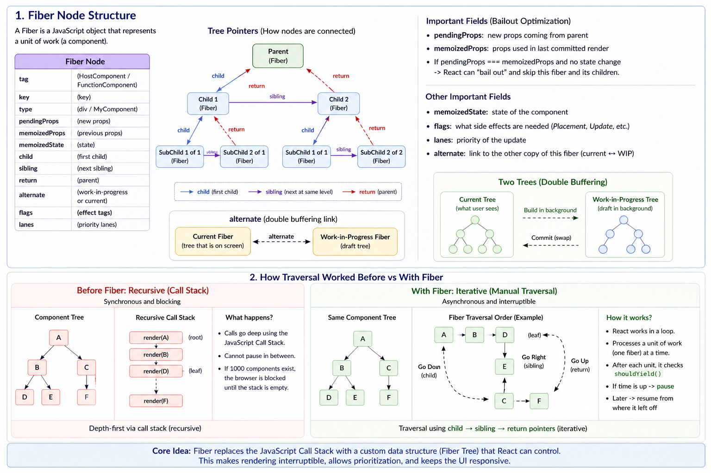

## What is React?

React is a JavaScript library for building user interfaces using **reusable components**.

React is built around two key ideas:

1. **Unidirectional Data Flow**: Data in React flows in **one direction only**
2. **Component-Based Architecture**: React applications are built by breaking the UI into **small, reusable, independent components**

## What is JSX (JavaScript XML)?

JSX is a syntax extension for JavaScript that lets you **write HTML-like code inside JavaScript**.

- It is syntactic sugar for `React.createElement`
- JSX gets compiled into `React.createElement()` calls. 
- It ultimately produces **React Elements** (plain JavaScript objects)

JSX is compiled by a **JavaScript compiler (transpiler)** — most commonly **Babel**.

### Example:
```jsx
<button className="btn">Click</button>
```

Behind the scenes:

```js
React.createElement('button', { className: 'btn' }, 'Click');

// Output (React Element)
{
  type: 'button',
  props: {
    className: 'btn',
    children: 'Click'
  }
}
```


## What is a React Element?

A **React Element** is a **plain immutable JavaScript object** that describes the UI.

### Structure of an Element

A React element has two main properties:

1. **type**: could be **DOM element** or **Component**
2. **props**: could be **attributes** (className, id, etc.) & **Children** (nested elements or text)

```js
{
  type: 'button' // string | Component,
  props: {
    // attributes + children
    className: 'btn',
    children: 'Click Me'
  }
}

// equivalent jsx
<button className="btn">Click Me</button>
```

## What is Virtual DOM (VDOM)?

The **Virtual DOM** is a **lightweight JavaScript representation of the real DOM**. 

## What is Reconciliation?

Reconciliation is the process React **uses to determine what changes are needed to update the UI efficiently**.
It works by **comparing the new Virtual DOM tree with the previous one (diffing)** and calculating the **minimal set of updates required**.
Reconciliation starts when state or props change (e.g., via `setState` or state updates in hooks).

By the end of this process:

- React knows what has changed
- A renderer like `react-dom` or `react-native` applies the minimal updates to the real DOM (or native views)

### Diffing Algorithm

The diffing algorithm is React’s O(n) heuristic **used during reconciliation to compare two trees efficiently**.

It is based on these assumptions:

1. Different element types produce different trees 
2. Same type → reuse instance and update props
3. Children are matched by position by default
4. Keys override position and provide stable identity
5. Comparison is done top-down (depth-first traversal)

## React Fiber Architecture

### 1. What is React Fiber?

React Fiber is the re-implementation of React's core algorithm. Its primary goal is Incremental Rendering: the ability to split rendering work into chunks and spread it out over multiple frames.

- **The Problem**: Before Fiber (Stack Reconciler), rendering was recursive and synchronous. Once it started, it couldn't stop until the entire tree was processed, which blocked the browser's main thread and caused UI "jank."
- **The Solution**: Fiber transforms the "stack" into a "virtual stack" using JavaScript objects. This allows React to pause, resume, or discard work based on priority.

### 2. The Fiber Node Structure

A "Fiber" is a plain JS object representing a unit of work. It uses pointers to navigate the tree iteratively rather than recursively:

- `child`: Points to the first direct child.
- `sibling`: Points to the next node at the same level.
- `return`: Points back to the parent (the "return" address after finishing work).
- `alternate`: A link to the "mirror" node in the double-buffering system (Current vs. WIP).

### 3. Double Buffering & The Two Trees

React maintains two trees simultaneously to ensure a smooth UI:

- **Current Tree**: The UI currently visible on the screen.
- **Work-in-Progress (WIP)** Tree: The "draft" tree where React prepares updates.

Why? To prevent "Tearing" (showing a partial/broken UI). React finishes the entire WIP tree in the background and then performs a "pointer swap" to make it the Current tree.

### 4. The Two-Phase Lifecycle

To enable interruptible work, React splits the rendering process:

| Phase   | Name                    | Nature                        | Responsibility                                                                        |
| ------- | ----------------------- | ----------------------------- | ------------------------------------------------------------------------------------- |
| Phase 1 | Reconciliation (Render) | Asynchronous & Interruptible  | Builds the new WIP tree; diffs the old vs. new tree; marks changes with "Effect Tags" |
| Phase 2 | Commit                  | Synchronous & Uninterruptible | Applying changes to the DOM; must be fast to avoid flickering                         |

### 5. The Work Loop & shouldYield

Because Fiber is iterative (not recursive), React can use a while loop to process the tree.

```js
while (workInProgress !== null && !shouldYield()) {
  workInProgress = performUnitOfWork(workInProgress);
}
```

React generally targets a 5ms frame deadline for concurrent work.

- When the work loop starts, React records the start time.
- After processing a Fiber node, it calls `shouldYield()`.
- If the elapsed time is greater than 5ms, `shouldYield()` returns true.
- React pauses the loop, saves the current workInProgress pointer, and tells the browser: "I'm done for now. If you have a click or a scroll to handle, do it now. Call me back when you're idle."

### 6. Scheduling & Lanes (Priority)

Incremental Rendering is the ability to split rendering into chunks. It introduces Priority-Based Updates.
React uses a system called Lanes to decide which update is most important. It uses "Bitmasks" (31 bits) to track multiple types of work at once.

Common Priority Levels:

- **Immediate/Sync**: Clicks, typing (Must feel instant).
- **Transition**: normal updates (Can be slightly delayed).
- **Idle**: Analytics or off-screen content (Low priority).

**Starvation Prevention**: If a low-priority task is ignored for too long, React automatically promotes it to "High Priority" so it eventually finishes.

### 7. Bailout Logic

- `pendingProps` → new props
- `memoizedProps` → previous props
  
If `pendingProps === memoizedProps` and no state changed, React "bails out" (skips) re-render.

### Diagram




## What is Shadow DOM?

Shadow DOM is a browser feature that lets you **attach a hidden, isolated DOM tree** to an element.

## React Batching 

Batching is when **React groups multiple state updates into a single re-render** to improve performance.
**Before React 18**, batching **only worked inside React event handlers like onClick, onChange etc**. Updates in `setTimeout`, `promises`, or `native event handlers (attached via addEventListener)` caused separate re-renders.
From **React 18 onward**, **automatic batching applies to all updates—including** those in `setTimeout`, `promises`, `native events`, and `other async code`.

You can **opt out of batching** using `flushSync`, which **forces React to immediately apply updates and re-render synchronously**.

## The rules of hooks
There are two main usage rules the React core team stipulates you need to follow to use hooks which they outline in the hooks proposal documentation.

1. **Don’t call** Hooks inside **loops, conditions, or nested functions**. Instead, always use Hooks at the **top level** of your React function.
2. Only Call Hooks from **React Functions**


## How React Tracks Hooks Internally

Note: in real React, each component instance has its own hooks storage
Constraint: React maps each Hook call to a fixed position in an internal array. Changing the order or number of Hooks breaks this mapping, causing state to be read from the wrong index.

```js
// Factory to create an isolated component instance
function createComponentInstance(Component) {
  // Each component instance gets its own hook storage
  let hooks = [];
  let hookIndex = 0;

  // Simulate React's render cycle for THIS component instance
  function render() {
    hookIndex = 0; // Reset before every render
    Component();
  }

  // Simplified useState implementation
  function useState(initialState) {
    let statePair = hooks[hookIndex];

    if (statePair) {
      // Existing state (not first render)
      hookIndex++;
      return statePair;
    }

    // First render: create state
    const currentIndex = hookIndex;

    function setState(newValue) {
      // Update the correct slot in the array
      hooks[currentIndex][0] = newValue;

      // Trigger re-render of THIS component instance
      render();
    }

    statePair = [initialState, setState];

    hooks[hookIndex] = statePair;
    hookIndex++;

    return statePair;
  }

  return {
    render,
    useState,
  };
}
```

## Core state hooks

### `useState`

`useState` lets you add a state variable to your component. 
A component's `state` persists persists across renders. `state` is local to a specific component instance. 

```js
const [state, setState] = useState(initialState)
```

---

### `useReducer`

`useReducer` lets you add a `reducer` to your component.

```js
function reducer(state, action) {
  switch (action.type) {
    case "incremented_age": {
      // ✅ Instead, return a new object
      return {
        ...state,
        age: state.age + 1,
      };
    }
  }
}

const [state, dispatch] = useReducer(reducer, initialArg, init?)

dispatch({
  type: "changed_name",
  payload: "Alice",
});
```

- `reducer`: The reducer function that **specifies how the state gets updated**. It must be **pure**, should take the **state** and **action** as arguments, and should **return the next state**.
- `initialArg`: The value from which the initial state is calculated. How the initial state is calculated from it depends on the next init argument.
- `optional init`: The initializer function that should return the initial state. If it’s not specified, the initial state is set to initialArg. Otherwise, the initial state is set to the result of calling init(initialArg).
- `dispatch`: lets you update the state. While you can pass anything to dispatch, the community standard is the Flux Standard Action (FSA) pattern: 
    - `type`: A string that describes the event.
    - `payload`: The data needed to perform the update.


## Effects 

### `useEffect`

`useEffect`lets you synchronize a component with an external system.
Here, **external system** means **any piece of code that’s not controlled by React**, such as:

- A timer managed with `setInterval()` and `clearInterval()`.
- An event subscription using `window.addEventListener()` and `window.removeEventListener()`.
- A third-party animation library with an API like `animation.start()` and `animation.reset()`.

```js
useEffect(setup, dependencies?)
```

#### Effect Lifecycle

- Component Mount → run setup
- Dependency change → run previous cleanup → run new setup
- ComponentUnmount → run cleanup

---

### `useLayoutEffect`

`useLayoutEffect` is a version of `useEffect` that fires before the browser repaints the screen. Call `useLayoutEffect` to perform the layout measurements before the browser repaints the screen.

```js
useLayoutEffect(setup, dependencies?)
```

## Refs & imperative APIs

### `useRef`

`useRef` lets you reference a value that’s not needed for rendering. Note: `ref.current` property is mutable.

```js
const ref = useRef(initialValue);
```

React saves the initial ref value once and ignores it on the next renders.

---

### `useImperativeHandle`

`useImperativeHandle` allows you to **manually define what a parent component sees when it accesses a `ref` on your component**. Main use of this hook is to **limit access**.
Starting in React 19, `ref` is a standard prop. You no longer need `forwardRef` to expose a DOM node's ref for new components.

```js
import { useRef, useImperativeHandle } from "react";

function MyInput({ ref }) {
  // 1. Create an internal ref to hold the actual DOM node
  const inputRef = useRef(null);

  // 2. Customize the 'handle' exposed to the parent
  useImperativeHandle(ref, () => {
    return {
      focus() {
        inputRef.current.focus();
      },
      scrollIntoView() {
        inputRef.current.scrollIntoView();
      },
    };
  }, []); // Dependencies array works like useEffect

  // 3. Attach the internal ref to the DOM element
  return <input ref={inputRef} />;
}
```

By `not passing the ref prop directly` to the `<input>`, you prevent the parent from accidentally changing styles or attributes it shouldn't touch.


## Memoization & performance

### `useMemo`

`useMemo` lets you **cache the result of a calculation** between re-renders.

```js
const cachedValue = useMemo(calculateValue, dependencies);
```

---

### `useCallback`

`useCallback` lets you **cache a function definition** between re-renders.
If you’re writing a **custom Hook**, it’s recommended to **wrap any functions that it returns into useCallback**

```js
const cachedFn = useCallback(fn, dependencies);
```

---

### `memo`

`memo` lets you **skip re-rendering (not a Guarantee) a component when its props are unchanged**.
`memo` lets you **skip re-rendering a component when its props are unchanged**.

```js
const MemoizedComponent = memo(SomeComponent, arePropsEqual?)
```

## Concurrent / scheduling hooks

### `useTransition`

"A **Transition** is a way to **mark a state update as 'non-urgent'**. In React, **updates are urgent by default (like typing in an input)**. By **wrapping a slow update** in `startTransition`, you tell React: **'Feel free to interrupt this if a more important task comes along.'**"

#### How it Works with Fiber (The Logic)

Transitions are the "Killer App" for the Lanes and Double Buffering system:

##### The Split:

When you use `startTransition`, React actually performs two updates.

1. **High-Priority (SyncLane)**: React updates any immediate UI (like an isPending spinner).
2. **Low-Priority (TransitionLane)**: React starts building a Work-in-Progress (WIP) tree for the heavy update in a background lane.

##### The Interruption:

If a user clicks or types while the WIP tree is being built, Fiber sees the SyncLane bit flip. It pauses or discards the transition work, handles the user input, and then restarts the transition with the newest state.

**Real-World Example: The Tab Switcher**
Imagine a dashboard with three tabs: Home, Profile, and Massive Reports.
**The Problem**: Without transitions, clicking "Massive Reports" freezes the whole app for 1 second while it renders 500 charts. If you accidentally clicked it and want to switch back to "Home" immediately, you can't—the UI is locked.
**The Solution**: Wrap the tab switch in a transition.
const [isPending, startTransition] = useTransition();
const [tab, setTab] = useState('home');

```js
function selectTab(nextTab) {
  // Marking the heavy tab-switch as a transition
  startTransition(() => {
    setTab(nextTab);
  });
}

return (
  <div style={{ opacity: isPending ? 0.7 : 1 }}>
    <TabButton onClick={() => selectTab("home")}>Home</TabButton>
    <TabButton onClick={() => selectTab("reports")}>Reports</TabButton>

    {/* If 'reports' is slow, the UI doesn't freeze! */}
    {tab === "reports" ? <HeavyReports /> : <Home />}
  </div>
);
```

---

### `useDeferredValue`

`useDeferredValue` is a hook that **takes a value and returns a 'deferred' version of it**. When the original value updates quickly (like a user typing), React will first render the UI with the old value to keep things responsive, and then—in the background—it will work on a new render with the new value.

#### How it works with Fiber (Under the Hood)

This hook is a direct application of the **Double Buffering** and **Lanes** concepts:
**Lane Switching**: When the original value changes, React treats the immediate update (e.g., updating an input field) as a SyncLane (High Priority).
**The Background Pass**: React then schedules a separate render for the deferred value in a TransitionLane (Low Priority).
**Interruptible Rendering**: Because the deferred render is in a low-priority lane, React can interrupt it. If the user types another character while React is halfway through rendering a huge list with the "old" deferred value, React throws away that work and starts fresh with the latest character.

#### Why use this instead of Debouncing/Throttling?

**Fixed Delays**: Debouncing uses a fixed timer (e.g., 300ms). If your computer is fast, you're waiting 300ms for no reason. If it's slow, 300ms might not be enough.
**Adaptability**: `useDeferredValue` has no fixed delay. It is "as fast as possible." On a powerful PC, the deferred update might happen in 10ms. On a slow phone, it might take 500ms. React adjusts based on the hardware

#### Example

**The Scenario**: Imagine a search bar where each keystroke filters a huge array. Without useDeferredValue, every letter you type triggers a heavy render, making the typing feel "laggy" or "stuck."

```js
import { useState, useDeferredValue, memo } from "react";

function App() {
  const [query, setQuery] = useState("");

  // 1. Create a "lagging" version of the query
  const deferredQuery = useDeferredValue(query);

  return (
    <div>
      {/* 2. The Input uses the REAL query (High Priority) */}
      <input
        value={query}
        onChange={(e) => setQuery(e.target.value)}
        placeholder="Type to search..."
      />

      {/* 3. The List uses the DEFERRED query (Low Priority) */}
      <SlowList text={deferredQuery} />
    </div>
  );
}

// 4. Wrap the slow component in memo!
// This tells React: "Only re-render if deferredQuery actually changes."
const SlowList = memo(({ text }) => {
  console.log(`Rendering list for: ${text}`);

  // Artificial delay: Imagine filtering 10,000 items here
  const items = [];
  for (let i = 0; i < 250; i++) {
    items.push(
      <li key={i}>
        Result for {text} #{i}
      </li>,
    );
  }

  return <ul>{items}</ul>;
});
```

#### How this works in the Fiber Tree (The "Why")

**High Priority Render:** When you type "A", setQuery("A") happens immediately. React renders the <input> with "A". Because deferredQuery hasn't updated yet (it's deferred), the SlowList sees the old value and memo tells it to skip rendering.
**Result:** The typing is instant and smooth.
**Low Priority Render (Background):** Once the input is painted on the screen, React starts a second background render pass. In this pass, it updates deferredQuery to "A".
**Interrupting:** If you type "B" while the background render for "A" is still happening:
React aborts the work for "A".
It handles the SyncLane for "B" in the input box.
It then starts a new background pass for "B".

## React DOM APIs

### `createRoot`

`createRoot` lets you **create a React root for displaying content inside a browser DOM node**.
After you’ve created a root, you need to call `root.render` to display a React component inside of it.
Apps using **server rendering or static generation** must call `hydrateRoot` instead of `createRoot`. React will then **hydrate (reuse) the DOM nodes from your HTML instead of destroying and re-creating them**.

```js
const domNode = document.getElementById("root");
const root = createRoot(domNode, options?)
root.render(<App />);
```

---

### `createPortal`

`createPortal` lets you **render some children** into a **different part of the DOM**. This lets a part of your component **“escape”** from whatever **containers it may be in**. Ex: Modal, tooltip etc

```js
<div>
  {createPortal(children, domNode, key?)}
</div>
```